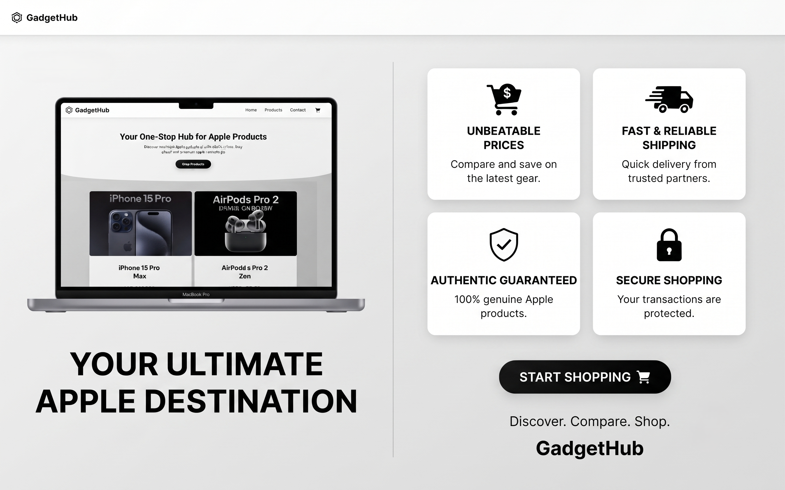
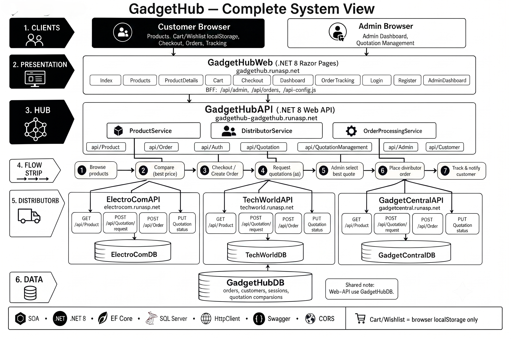
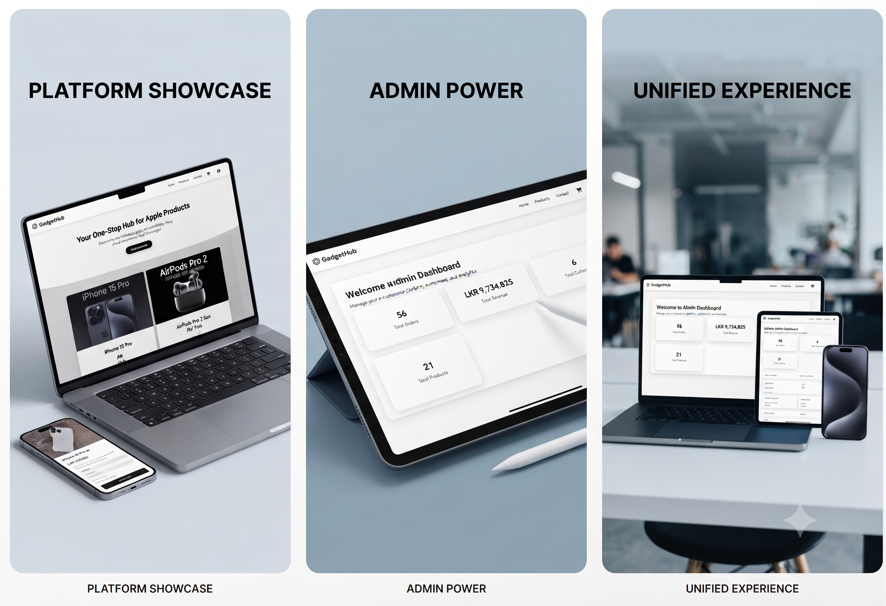
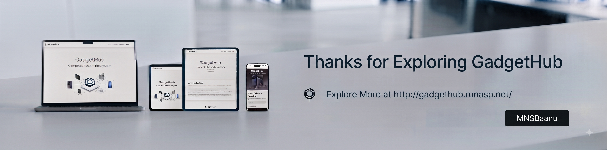

# GadgetHub


A Service-Oriented Architecture (SOA) e-commerce platform for gadgets. The system connects to three distributors - **ElectroCom**, **TechWorld**, and **GadgetCentral** - and automatically compares prices to get the best deal for customers.


## Features

- Compare prices across three distributor APIs
- Customer storefront with cart, wishlist, and checkout
- Admin dashboard for orders, products, and customers
- Quotation-based order processing



## Tech Stack

| Layer | Technology |
| --- | --- |
| Backend | ASP.NET Core Web API (.NET 8) |
| Frontend | ASP.NET Core Razor Pages (.NET 8) |
| Database | SQL Server + Entity Framework Core |

## Architecture



| Service | Description |
| --- | --- |
| GadgetHubWeb | Customer-facing web app |
| GadgetHubAPI | Main API - orders, customers, quotation comparison |
| ElectroComAPI | Distributor API |
| TechWorldAPI | Distributor API |
| GadgetCentralAPI | Distributor API |


## Prerequisites

- [.NET 8 SDK](https://dotnet.microsoft.com/download/dotnet/8.0)
- SQL Server (LocalDB, Express, or full)
- Database backups/scripts in `Database/` (local only)

## Run Locally

1. Restore the databases from `Database/` into SQL Server.
2. Update connection strings in each project's `appsettings.json`.
3. Start all five services (separate terminals):

```bash
dotnet run --project GadgetHubAPI
dotnet run --project ElectroComAPI
dotnet run --project TechWorldAPI
dotnet run --project GadgetCentralAPI
dotnet run --project GadgetHubWeb
```

4. Open the web app URL shown in the `GadgetHubWeb` console (typically `https://localhost:7xxx`).

## Platform Showcase



## Demo Credentials

| Role | Email | Password |
| --- | --- | --- |
| Admin | admin@gadgethub.com | admin123 |
| User | user1@gmail.com | user123 |

## Contributing

Contributions are welcome. Please follow these steps:

1. **Fork** the repository on GitHub.
2. **Clone** your fork:

   ```bash
   git clone https://github.com/MNSBaanu/GadgetHub.git
   cd GadgetHub
   ```

3. **Create a branch** for your change:

   ```bash
   git checkout -b feature/your-feature-name
   ```

4. **Make your changes**, then build to verify:

   ```bash
   dotnet build GadgetHub.sln --configuration Release
   ```

5. **Commit** with a clear message:

   ```bash
   git add .
   git commit -m "Describe your change"
   ```

6. **Push** your branch and open a **Pull Request** against `main`:

   ```bash
   git push -u origin feature/your-feature-name
   ```

### Guidelines

- Keep PRs focused on a single change.
- Follow existing code style and project structure.

---


